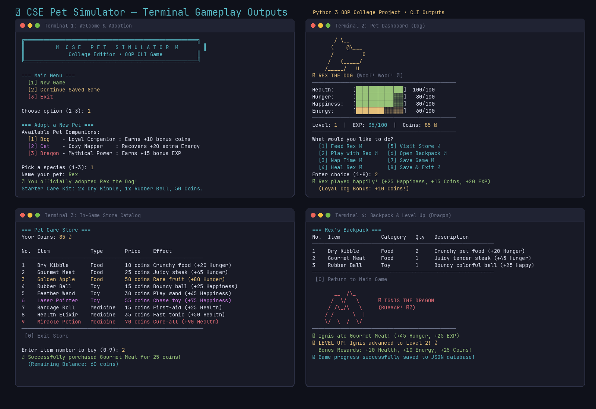

# 🐾 CSE Project — Virtual Pet Simulator

[](https://www.python.org/)
[-brightgreen.svg)](#-object-oriented-programming-concepts)
[-success.svg)](#-how-to-run)
[](#-how-to-run)

An interactive, text-based **Virtual Pet Simulator** written in Python 3. This project demonstrates core **Object-Oriented Programming (OOP)** principles—including inheritance, polymorphism, encapsulation, and JSON-based state persistence—within a practical, dependency-free command-line game.

---

## 📸 Gameplay Showcase

Here is a preview of the terminal interface, including pet adoption, real-time vital status bars, the in-game shop, and the backpack inventory:



---

## ⚡ How to Run

### Requirements
- Python 3.6 or higher installed
- Works out-of-the-box on **Linux**, **macOS**, and **Windows**
- **Zero external dependencies**: Built entirely with Python's standard library (`json`, `os`, `random`, `sys`)

### Start the Game
Run the main script from your terminal:

```bash
python3 main.py
```

*(On Windows, you can also run `python main.py`)*

---

## 🎮 Game Features & Mechanics

### 1. Adoptable Pet Companions
Players can choose from three companion types, each featuring distinct ASCII artwork, voice lines, and gameplay traits:

| Companion | Archetype | Unique Perk | Dialogue |
|---|---|---|---|
| 🐶 **Dog** | Loyal Companion | Earns **+10 bonus coins** during play sessions | *"Woof! Woof! 🐶"* |
| 🐱 **Cat** | Cozy Napper | Recovers **+20 extra Energy** when taking a nap | *"Meow~ Purrr... 🐱"* |
| 🐉 **Dragon** | Mythical Power | Gains **+15 bonus EXP** on all developmental activities | *"ROAAAR! 🔥🐉"* |

### 2. Vital Stats & Progress Engine
- **Health (0–100):** Depleted when neglected; restored using medical remedies.
- **Hunger (0–100):** Drains over time and through activities; replenished with food.
- **Happiness (0–100):** Boosted through play sessions and toys; decreases with fatigue.
- **Energy (0–100):** Consumed by playing; replenished through restful sleep.
- **Dynamic Status Bars:** Color-coded terminal progress bars (Green for healthy `>60%`, Yellow for caution `>30%`, Red for critical `<30%`).

### 3. Economy & Pet Care Store
Earn coins by playing and leveling up. Spend coins at the in-game store across three categories:
- **Food:** *Dry Kibble* (+20 Hunger), *Gourmet Meat* (+45 Hunger), *Golden Apple* (+80 Hunger)
- **Toys:** *Rubber Ball* (+25 Happiness), *Feather Wand* (+45 Happiness), *Laser Pointer* (+75 Happiness)
- **Medicine:** *Bandage Roll* (+25 Health), *Health Elixir* (+50 Health), *Miracle Potion* (+90 Health)

### 4. Backpack & Stacking Inventory
- **Stackable items:** Duplicate items automatically increment quantity rather than taking up extra slots.
- **Category filtering:** Browse and use items directly or through context-sensitive action menus.

### 5. Level Progression & Milestones
- Every action awards Experience Points (EXP).
- Gaining 100 EXP triggers a **Level Up**, awarding stat increases and bonus currency.

### 6. JSON Save & Load Persistence
- Game state automatically serializes to `data/pet_save.json`.
- Seamlessly resume previous games right from the main menu without needing an external database server.

---

## 🧠 Object-Oriented Programming (OOP) Concepts

This project was built to illustrate real-world application of the core OOP pillars:

| OOP Pillar | Implementation in this Project |
|---|---|
| **Classes & Objects** | Concrete classes for `Item`, `Inventory`, `Pet`, `Dog`, `Cat`, `Dragon`, and `Shop`. Objects are instantiated dynamically at runtime. |
| **Inheritance** | `Dog`, `Cat`, and `Dragon` inherit common attributes (`health`, `hunger`, `coins`, `inventory`) and methods (`feed()`, `heal()`, `clamp()`) from the parent `Pet` class. |
| **Polymorphism** | Subclasses override methods (`speak()`, `play()`, `sleep()`, `gain_exp()`) to deliver species-specific perks while maintaining the same method interface. |
| **Encapsulation** | State mutations pass through validation routines (such as the `clamp()` method), preventing stats from exceeding 100 or dipping below 0. |
| **Abstraction** | The `Shop` and `Inventory` classes conceal internal data representations (lists, dictionaries), exposing clean, high-level methods like `buy_item()` and `use_item()`. |

---

## 📁 Project Structure

```text
CSE-project--pet-simulator-/
├── main.py            # Main game executable, class definitions & game loop
├── readme.md          # Project overview, gameplay guide & viva notes
├── statements.md      # Detailed problem statement, academic motivation & features
└── screenshots.png    # Gameplay terminal screenshots and UI showcase
```

> 📄 For the formal Problem Statement and academic curriculum objectives, see [statements.md](statements.md).

---

## 🎓 College Viva / Lab Questions & Answers

### Q1: Where and why is Inheritance used in this project?
> **Answer:** `Dog`, `Cat`, and `Dragon` inherit from the base `Pet` class (`class Dog(Pet)`). Inheritance avoids code duplication by centralizing shared state (`health`, `hunger`, `coins`, `inventory`) and common behaviors (`feed`, `heal`, `clamp`, `save`) in `Pet`, while allowing subclasses to add specialized attributes or behavior.

### Q2: How is Polymorphism demonstrated?
> **Answer:** Polymorphism is implemented via method overriding:
> - `pet.speak()` returns distinct dialogue for each companion (`"Woof! Woof!"` for dogs, `"Meow~ Purrr..."` for cats, `"ROAAAR!"` for dragons).
> - `Dog.play()` overrides `Pet.play()` to provide a bonus coin reward.
> - `Cat.sleep()` overrides `Pet.sleep()` to restore extra energy.
> - `Dragon.gain_exp()` overrides `Pet.gain_exp()` to grant bonus experience.
> The caller can invoke these methods uniformly without needing to know the concrete subclass.

### Q3: How is Encapsulation enforced?
> **Answer:** All stat modifications pass through helper validation methods like `clamp()`, ensuring that `health`, `hunger`, `happiness`, and `energy` are always constrained between `0` and `100`. Furthermore, item operations are encapsulated inside `Inventory` methods (`add_item`, `remove_item`, `use_item`) rather than having external code directly manipulate raw list structures.

### Q4: How is persistence handled without a database server?
> **Answer:** Persistence is implemented using JSON serialization via Python's built-in `json` module. When saving, `to_dict()` converts pet and inventory objects into structured dictionaries saved to `data/pet_save.json`. When loading, `load_game()` reads the JSON file, checks the `species` tag, and dynamically instantiates the correct subclass (`Dog`, `Cat`, or `Dragon`) with restored stats and inventory items.

---

## 📋 Project Information

- **Course:** B.Tech Computer Science & Engineering
- **Subject:** Object-Oriented Programming (OOP) in Python
- **Language:** Python 3 (Pure Standard Library)
- **Files:** [main.py](main.py) • [readme.md](readme.md) • [statements.md](statements.md) • [screenshots.png](screenshots.png)
